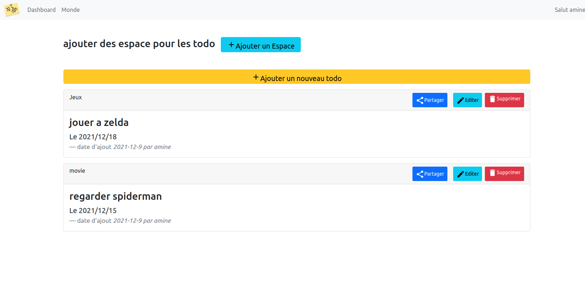

# Todo Application  realiser avec le framework flask 

## Build with
- Flask/jinja
- Python
- HTML/css 
- SQL Alchemy

## Getting Started
Get a local copy up and follow this steps

## Prerequisites
- Python
- Pip
- flask
For more information visit this Link : https://flask.palletsprojects.com/en/2.0.x/installation/

## Local Development
- Open the terminal and start a server with 'python run.py'
- Open http://localhost:5000 in your browser

## Usage
- Sign up as a buyer by providing a name, email, address and password.
- Start browsing todo 
- Add Spaces and then add todo 

## The Author
- GitHub: @minos95
- Twitter: @aminos_rahal
- LinkedIn: rahal sidahmed
